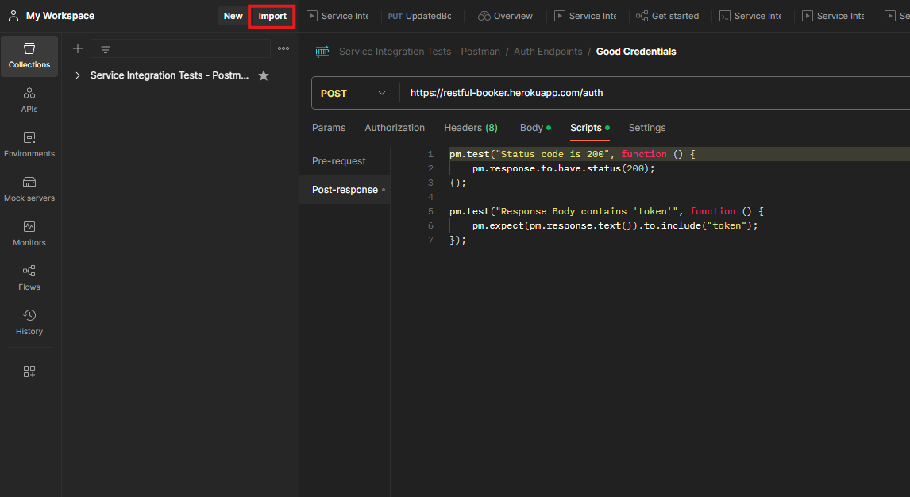

# API-Testing-Demo-Postman
### Description
This is a Postman collection that is a copy of the API Service Demo. If you look at all the requests, you will notice they are all set-up and ready to be ran out of the box. You will notice that all the calls have tests in the script section.

### Prerequisites
- Postman account and postman web or client setup and working.

### Installation
1. **Locate the file this repo contains (not readme or license)**
2. **Go to Postman and click the **Import** button.**

    

3. **Upload the file from this repo.**

    

4. **You should now see some requests avaiulable to use.**

    
